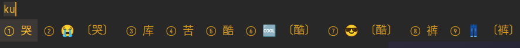
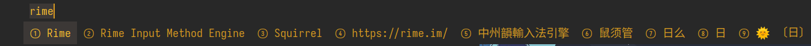
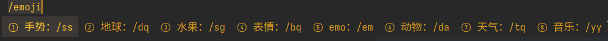
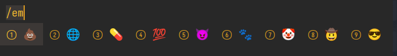

# Manjaro 输入法配置


## 安装

1. 安装fcitx5框架

```bash
sudo pacman -S fcitx5-im
```

2. 安装rime和双拼方案

```bash
sudo pacman -S fcitx5-rime rime-double-pinyin
```


## 配置

1. 确认系统显示服务器

    使用 `echo ${XDG_SESSION_TYPE} ` 命令查看显示服务器是 `x11`,  还是 `wayland`

1.1 如果显示服务器是 `x11`, 则编辑 ` ~/.xprofile ` 文件

```bash
export GTK_IM_MODULE=fcitx5
export QT_IM_MODULE=fcitx5
export XMODIFIERS=@im=fcitx5
```

1.2 如果显示服务器是`wayland` , 则编辑 `~/.pam_environment` 文件

```bash
GTK_IM_MODULE=fcitx5
QT_IM_MODULE=fcitx5
XMODIFIERS=@im=fcitx5
```

2. 配置

- 将 [dotfiles repo](https://github.com/ScriptGo/dotfiles/tree/main/config) 中的 `fcitx5` 文件夹复制到`~/.config/` 目录下
- 将 `本repo` 复制到 `~/.local/share/fcitx5/` 目录下

3. 美化

下载以下主题

```bash
https://github.com/ayamir/fcitx5-nord
https://github.com/ayamir/fcitx5-gruvbox
```

 将其复制到 `~/.local/share/fcitx5/themes/` 目录, 然后修改配置文件 `~/.config/fcitx5/conf/classicui.conf`

```bash
Theme=Gruvbox-Dark
```

**注意：修改配置文件 `~/.config/fcitx5/profile` 时，请务必退出 fcitx5 输入法，
否则会因为输入法退出时会覆盖配置文件导致之前的修改被覆盖；修改其他配置文件可以不用退出 fcitx5 输入法.**

`重启后生效` 


## rime

1. 总览

    | 配置文件             | 配置说明                             |
    | -------------------- | ----------------------------------|
    | default.custom.yaml  | 输入方案、候选栏、快捷键等             |
    | extended.dict.yaml   | 扩展词库                           |
    | flypy.schema.ymal    | 自定义小鹤双拼方案                    |
    | symbols.custom.yaml  | 自定义标点符号                           |
    | custom_phrase.txt    | 自定义短语                           |

2. 说明

此配置是针对 `小鹤双拼`方案的，不一定适合所有人，可以在此基础上进行修改。

3. 表情符号

```bash
    symbols:
      "/emoji": [ 手势：/ss, 地球：/dq, 水果：/sg, 表情：/bq, emo：/em, 动物：/da, 天气：/tq, 音乐：/yy ]
      "/sym": [ 符号：/fh, 标志：/bz, 电脑：/dn , 清单：/td 节气：/jq, 单位：/dw, 标点：/bd, 拼音：/py, 货币：/hb ]
      "/math": [ 数学：/sx, 数字：/0到/9, 分数：/fs 括号：/kh, 星号：/xh, 方块：/fk, 几何：/jh, 箭头：/jt, 罗马数字：/lm, 大写罗马数字：/lmd, 拉丁：/ld, 上标：/sb, 下标：/xb, 希腊字母：/xl, 大写希腊字母：/xld ]
```

4. 词库

如需添加或修改词库，编辑 `extended.dict.yaml` 文件即可

**本方案主要采用的是 [iDvel/rime-ice](https://github.com/iDvel/rime-ice) 这个仓库的词库, 略有增删**

```bash
import_tables:
  # - luna_pinyin #默认词库,如需启用请取消注释

  - dicts/simp
  - dicts/base
  - dicts/ext
  - dicts/sogou
  - dicts/tencent
  - dicts/others
```

**词库文件要与 extended.dict.yaml文件在同一目录，或者将词库文件统一放在一个目录**

5. 截图

    正常输入
    

    自定义短语
    

    自定义符号
    
    


## 参考/致谢

   1. [鼠须管配置 2021](https://placeless.net/blog/rime-squirrel-customization-2021)
   2. [我的 Rime 配置 2022](https://dvel.me/posts/my-rime-setting-2022/)
